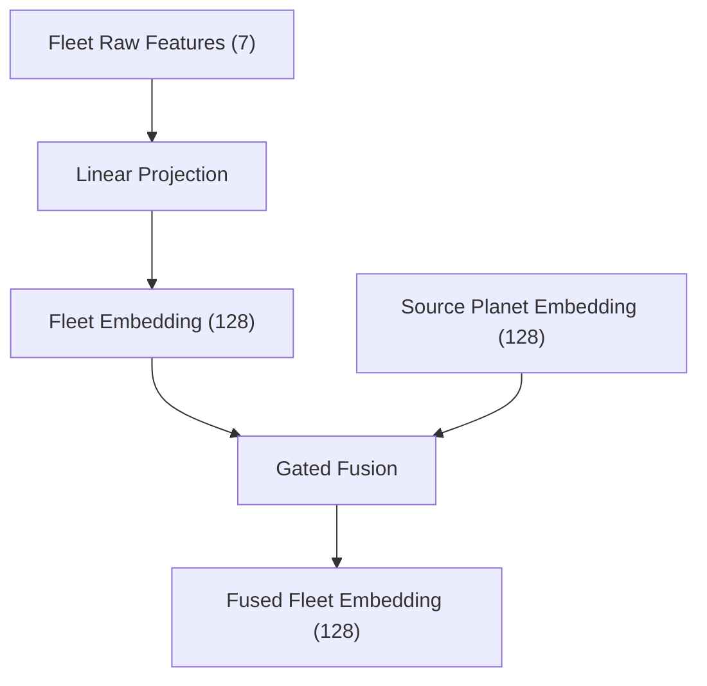

# Orbit Wars PPO Agent

Kaggle Orbit Wars용 강화학습 에이전트 저장소다. 현재 주 경로는 **PPO + self/league/exploiter self-play**이며, 제출 추론도 학습과 같은 **encode → mask → sample → decode** 파이프라인을 사용한다.

이 README는 처음 보는 사람이 아래 네 가지를 빠르게 이해하도록 쓰였다.

1. 입력 관측이 어떻게 텐서로 바뀌는가
2. 정책이 어떤 행동 표현을 출력하는가
3. 그 출력이 어떻게 실제 게임 move로 디코드되는가
4. 학습 루프가 어떤 상대 분포와 보상으로 정책을 업데이트하는가

## 한눈에 보기

```text
Kaggle obs
  → encoder (planet/fleet/history)
  → OrbitWarsPolicy / OrbitWarsActor
  → action logits
  → action-space analysis (launch_mask, target_mask)
  → masked sampling
  → decode_action_to_moves()
  → [from_planet_id, angle, num_ships]
```

핵심은 **모델이 바로 Kaggle move를 내지 않는다는 점**이다.  
모델은 각 행성에 대해 추상 행동을 출력하고, 디코더가 그것을 실제 게임 액션으로 변환한다.

## 현재 구조

```text
orbitwaaa/
├── main.py                 # 제출용 entrypoint. 학습과 같은 mask/sample/decode 재사용
├── submission_features.py  # 제출용 encoder (학습 encoder와 parity 유지)
├── submission_actor.py     # actor-only 추론 모델
├── model.py                # 학습용 정책/가치 모델
├── env_wrapper.py          # 학습용 encoder / Gym wrapper
├── train.py                # PPO, self-play, eval, league, decode
├── prediction.py           # aim, ETA, 태양/경로 충돌, 점령 필요 ships 계산
├── config.yaml             # 모델/학습/self-play 설정
├── utils/
│   ├── logger.py           # CSV + 콘솔 로깅
│   ├── checkpoint.py       # resume/checkpoint
│   └── hit_tracker.py      # 명중/점령/연계공격/유지율 계측
├── tests/                  # encoder / tracker / PPO shape 회귀 테스트
└── checkpoints/            # 학습 산출물
```

## 정책이 보는 입력

관측은 `planet history`와 `fleet history`를 평탄화한 벡터다.

- 행성 텐서: `(HISTORY, MAX_PLANETS, PLANET_DIM)`
- fleet 텐서: `(HISTORY, MAX_FLEETS, FLEET_DIM)`
- 현재 기본값:
  - `HISTORY = 20`
  - `MAX_PLANETS = 40`
  - `MAX_FLEETS = 100`
  - `PLANET_DIM = 23`
  - `FLEET_DIM = 8`  (마지막 dim = `from_planet_idx`, -1 sentinel)

## Encoder

현재 인코더는 두 개다.

- `Planet Encoder`: 각 planet token을 현재 행성 상태 표현으로 바꾼다
- `Fleet Encoder`: 각 fleet token을 현재 함대 상태 표현으로 바꾸고, 출발한 source planet의 현재 표현을 붙여 최종 fleet 표현을 만든다

### Planet Encoder

행성 feature는 크게 네 묶음이다.

1. 기본 상태
- 좌표, owner one-hot, ships, production, orbit/comet 여부

2. 전술 압력
- `enemy_near`, `enemy_mid`
- `mine_near`, `mine_mid`

3. 타겟 quality
- `min_eta_norm`
- `required_to_capture_norm`
- `best_src_ships_norm`
- `feasibility_ratio`

4. source-side 방어 정보
- `source_enemy_pressure_norm`
- `source_nearest_enemy_eta_norm`

의도는 전략을 직접 주입하는 게 아니라, **정책이 판단할 원시 사실을 계산해서 제공**하는 것이다.

### Fleet Encoder

fleet encoder는 먼저 이동 중인 함대의 현재 상태를 읽고, 그 다음 출발한 source planet의 현재 embedding을 lookup해서 gated fusion으로 합친다.



- raw fleet feature는 `x, y, cos(angle), sin(angle), ships, is_mine, is_enemy`다
- 이 7개 feature는 `Linear(7 → 128)`을 거쳐 `fleet embedding`이 된다
- `from_planet_idx`는 숫자 feature로 학습하지 않고, 현재 `source planet embedding`을 찾는 lookup 포인터로만 쓴다
- 마지막에는 `gated fusion`으로 `fleet embedding`과 `source planet embedding`을 합쳐 `fused fleet embedding`을 만든다

fleet가 직접 보는 raw feature 의미는 아래와 같다.

- `x, y`: 현재 fleet 위치
- `cos(angle), sin(angle)`: 현재 진행 방향
- `ships`: 이동 중인 병력 규모
- `is_mine, is_enemy`: 내 fleet인지 적 fleet인지

최종 `fused fleet embedding`은 아래 두 정보를 함께 담는다.

- fleet 자체의 현재 상태: 어디에 있고, 어느 방향으로, 얼마나 큰 병력이 움직이는가
- source planet의 현재 상태: 그 fleet가 출발한 행성이 지금 안전한지, 압력이 있는지, 병력을 더 뽑을 수 있는지

## 정책 네트워크

`model.py`의 `OrbitWarsPolicy`는 hierarchical transformer 구조다.

```text
Planet/Fleet Embed
  → Temporal Attention
  → Local Attention (planet ↔ fleet)
  → Global Attention
  → Actor / Critic
```

기본 설정:

- `embed_dim = 128`
- `num_heads = 8`
- `planet_temporal_layers = 2`
- `fleet_temporal_layers = 1`
- `local_layers = 2`
- `global_layers = 4`

### Actor 출력

정책은 각 행성마다 다음을 출력한다.

```text
[launch(1), ships_bin(K), target(MAX_PLANETS)]
```

즉 한 행성 단위 행동은:

1. 발사할지
2. 얼마나 보낼지
3. 어디를 칠지

를 나눠서 고르는 구조다.

현재 ships head는 연속값이 아니라 배수 선택이다.

- `1.10x`
- `1.30x`
- `1.60x`
- `2.00x`

여기서 `required_ships`는 대략:

```text
target.ships + target.production * turns + 1
```

이고, 실제 발사량은 decode에서 `src.ships`로 clip된다.

## 디코더가 하는 일

모델 출력은 아직 Kaggle move가 아니다.  
`train.py`의 `decode_action_to_moves()`가 실제 move를 만든다.

### 왜 디코더가 필요한가

모델이 직접 `[planet_id, angle, num_ships]`를 끝까지 회귀하는 구조가 아니라,

- launch
- ships bin
- target

만 고르기 때문이다.

디코더는 다음을 계산한다.

1. target까지의 조준 각도
2. 도달 ETA
3. 필요한 ships 수
4. 태양 충돌 여부
5. 실제 first collision이 target인지

그 결과 최종 move:

```python
[from_planet_id, angle, num_ships]
```

를 반환한다.

### 학습-제출 parity

이 저장소는 **추론도 학습과 같은 디코더를 재사용**한다.

즉 제출 경로(`main.py`)도:

1. `analyze_action_space()`
2. `launch_mask`, `target_mask`
3. masked sampling
4. `decode_action_to_moves()`

를 그대로 쓴다.

이 parity가 깨지면 학습 때 배운 policy semantics와 제출 행동 semantics가 달라져 성능이 무너질 수 있다.

## 액션 마스크

`analyze_action_space()`는 두 개의 마스크를 만든다.

- `launch_mask`
- `target_mask`

역할:

- 내가 소유한 행성만 source 후보로 둠
- 자기 행성 target 제거
- sun/path 상 명백히 성립하지 않는 target 제거

정책은 이 마스크 위에서 샘플링한다.  
즉 **불가능하거나 의미 없는 행동만 줄이고**, 전략 자체는 열어둔다.

## 학습 루프

핵심 엔트리포인트는 `train.py`의 `train()`이다.

한 generation은 대략:

1. `main_model`의 상대를 샘플링
2. rollout 수집
3. PPO update
4. `exploiter`도 별도 rollout으로 update
5. 주기적으로 eval / exploiter_eval
6. `main_model` snapshot을 league에 편입

### 상대 분포

현재 `main_model` rollout 상대는 3-way mix다.

- `self`
- `league`
- `exploiter`

비율은 `config.yaml`의 `selfplay.opponent_mix`에서 관리한다.

### League

`LeaguePool`은 과거 `main_model` snapshot 저장소다.

- PPO update를 받지 않음
- 상대 샘플링용으로만 사용
- 현재는 매 generation마다 편입
- `pool_size = 10`

### Exploiter

`exploiter`는 `main_model`의 약점을 공략하도록 별도 PPO로 학습되는 보조 상대다.

- `main_model`과 파라미터/optimizer를 공유하지 않음
- current `main_model` 복사본을 상대로 rollout
- 주기적으로 리셋됨

## 보상

현재 보상은 크게 세 층이다.

1. terminal reward
- 승: `+5`
- 패: `-5`

2. dense reward
- `state_score` 차이의 변화량

3. capture bonus
- 점령 보너스
- 상실 페널티

현재 방향은 **전략을 직접 강제하지 않고**, 승패와 유지 비용 쪽으로만 약하게 shaping하는 것이다.

## 로그 읽는 법

학습 로그는 `checkpoints/logs/train_*.csv`에 쌓인다.

중요한 컬럼:

- `win_rate`
- `send_required_ratio_mean`
- `under_invested_rate`
- `send_required_ratio_mean_enemy`
- `under_invested_rate_enemy`
- `repeat_target_rate`
- `launch_to_cap_rate_neutral`
- `launch_to_cap_rate_enemy`
- `single_shot_capture_rate`
- `capture_hold_k_rate`
- `post_capture_reloss_rate_k`
- `all_in_launch_rate`
- `remaining_ships_after_launch_mean`
- `distinct_targets_per_turn`

간단 해석:

- `under_invested_rate` 높음: 필요한 양보다 부족하게 보내는 공격이 많음
- `send_required_ratio_mean` 낮음: 실제 발사량이 required에 못 미침
- `launch_to_cap_rate_enemy` 높음: 적 타겟 압박은 결국 점령으로 이어짐
- `all_in_launch_rate` 높음: source를 과하게 비움
- `capture_hold_k_rate` 낮음: 먹고도 유지 못 함
- `distinct_targets_per_turn` 높음: 집중 공격보다 분산 난사 성향

## 제출 경로

제출 엔트리포인트는 `main.py`다.

동작:

1. `weights.pt` 또는 `ORBIT_WEIGHTS` 환경변수에서 가중치 로드
2. `submission_features.py`로 입력 인코딩
3. `submission_actor.py` forward
4. `train.py`의 `analyze_action_space()` / `decode_action_to_moves()` 재사용

즉 제출은 별도 rule-based wrapper가 아니라 **순수 RL 정책 + 학습과 같은 decode**다.

## 자주 쓰는 명령

### smoke

```bash
.venv/bin/python train.py --smoke --run-dir checkpoints_smoke
```

### baseline 학습

```bash
.venv/bin/python train.py --run-dir checkpoints/baseline_1cha
```

### 테스트

```bash
.venv/bin/pytest -q
```

### 최신 로그 보기

```bash
tail -f "$(ls -t checkpoints/logs/train_*.csv | head -1)"
```

## 현재 프로젝트에서 중요한 해석

최근 실험 기준으로 이 에이전트의 핵심 병목은 보통 아래 둘 중 하나다.

1. **under-invest**
- 좋은 타겟을 골라도 실제 ships allocation이 부족함

2. **source reserve 부족**
- source를 과하게 비워서 점령 후 유지/방어가 무너짐

그래서 최근 실험은 주로 아래를 검증한다.

- 단발 점령이 늘어나는가
- 점령 후 유지율이 올라가는가
- 재상실률이 내려가는가
- source all-in이 줄어드는가
- 분산 난사가 줄어드는가

## 참고

- Kaggle 제출/로컬 실행 기본 규칙은 [AGENTS.md](/Users/sngmin/orbitwaaa/AGENTS.md)에 정리돼 있다.
- 실제 게임 룰 요약은 [GAME_RULES.md](/Users/sngmin/orbitwaaa/GAME_RULES.md)에 있다.
