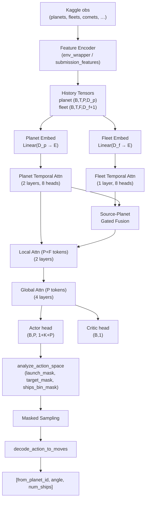
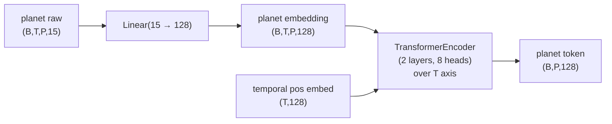
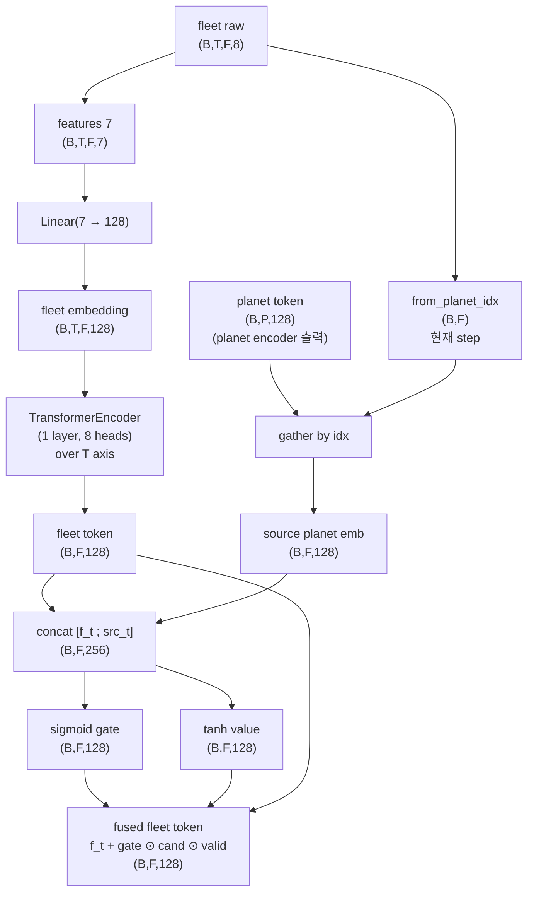
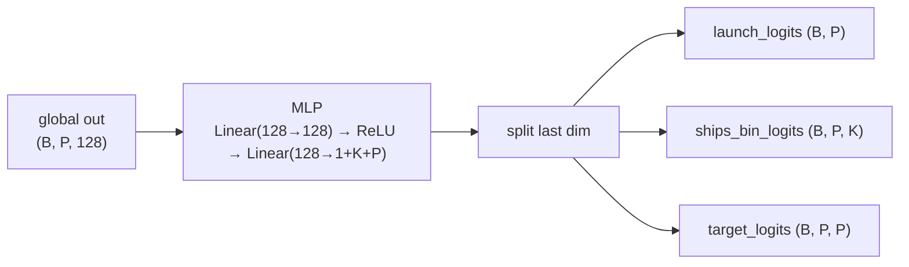
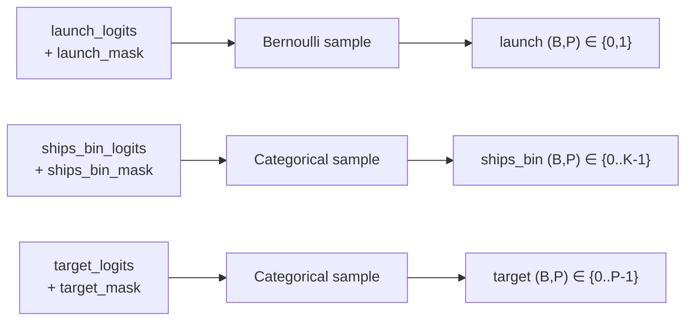

# Orbit Wars PPO Agent

Kaggle Orbit Wars용 강화학습 에이전트 저장소다. 현재 주 경로는 **PPO + self/league/exploiter self-play**이며, 제출 추론도 학습과 같은 **encode → mask → sample → decode** 파이프라인을 사용한다.

이 README는 처음 보는 사람이 아래 네 가지를 빠르게 이해하도록 쓰였다.

1. 입력 관측이 어떻게 텐서로 바뀌는가
2. 정책이 어떤 행동 표현을 출력하는가
3. 그 출력이 어떻게 실제 게임 move로 디코드되는가
4. 학습 루프가 어떤 상대 분포와 보상으로 정책을 업데이트하는가

## 한눈에 보기

```text
Kaggle obs
  → encoder (planet/fleet/history)
  → OrbitWarsPolicy / OrbitWarsActor
  → action logits
  → action-space analysis (launch_mask, target_mask)
  → masked sampling
  → decode_action_to_moves()
  → [from_planet_id, angle, num_ships]
```

핵심은 **모델이 바로 Kaggle move를 내지 않는다는 점**이다.  
모델은 각 행성에 대해 추상 행동을 출력하고, 디코더가 그것을 실제 게임 액션으로 변환한다.

## 현재 구조

```text
orbitwaaa/
├── main.py                 # 제출용 entrypoint. 학습과 같은 mask/sample/decode 재사용
├── submission_features.py  # 제출용 encoder (학습 encoder와 parity 유지)
├── submission_actor.py     # actor-only 추론 모델
├── model.py                # 학습용 정책/가치 모델
├── env_wrapper.py          # 학습용 encoder / Gym wrapper
├── train.py                # PPO, self-play, eval, league, decode
├── prediction.py           # aim, ETA, 태양/경로 충돌, 점령 필요 ships 계산
├── config.yaml             # 모델/학습/self-play 설정
├── utils/
│   ├── logger.py           # CSV + 콘솔 로깅
│   ├── checkpoint.py       # resume/checkpoint
│   └── hit_tracker.py      # 명중/점령/연계공격/유지율 계측
├── tests/                  # encoder / tracker / PPO shape 회귀 테스트
└── checkpoints/            # 학습 산출물
```

## 모델 설계 개요

이 절은 인코더/디코더를 본격적으로 설명하기 전에 **무엇을 입력으로 받고 무엇을 내보내며 텐서가 어떻게 흐르는지** 정리한다. 게임 룰의 자세한 정의는 [GAME_RULES.md](/Users/sngmin/orbitwaaa/GAME_RULES.md) 참조.

### 1. Task & 환경

- 2인 PvP, **100×100 연속 2D** 보드, 중심 (50,50) 에 반경 10 sun
- **최대 500 turn**, 정책은 매 턴 호출됨
- 행성: 맵당 20-40개, 4-fold mirror symmetry, 일부는 sun 주위를 회전 (orbiting) — `angular_velocity` 0.025-0.05 rad/turn
- 소유 행성은 매 턴 `production` (1-5) ships 생산, 시작 ships 5-99 (홈은 10)
- 함대 속도: `1.0 + (max_speed - 1.0) * (log(ships)/log(1000))^1.5` — **ships 많을수록 빠름**, sun 가로지르면 소멸
- comet은 step `50/150/250/350/450` 에 4개씩 소환 (행성과 동일하게 점령/생산 대상)
- 종료 시 점수 = `소유 행성 ships + 소유 함대 ships`, 더 큰 쪽 승

이 환경에서 정책이 진짜 답해야 할 질문은 둘이다.

1. **어디서 어디로 보낼 것인가** (source / target 선택)
2. **얼마나 보낼 것인가** (점령에 필요한 ships vs source 보존)

### 2. Observation 표현

원본 Kaggle obs (`planets`, `fleets`, `comets`, `angular_velocity`, …) 는 모델에 그대로 들어가지 않는다. `env_wrapper.py` / `submission_features.py` 가 매 턴 **고정 크기 텐서**로 인코딩하고, 모델은 마지막 `HISTORY` 턴 누적 텐서를 본다.

| 필드 | shape | 의미 |
|---|---|---|
| planet history | `(HISTORY, MAX_PLANETS, PLANET_DIM)` | 행성 토큰 시계열 |
| fleet history  | `(HISTORY, MAX_FLEETS,  FLEET_DIM)`  | 함대 토큰 시계열 |
| 평탄화 obs     | `(HISTORY * (MAX_PLANETS*PLANET_DIM + MAX_FLEETS*FLEET_DIM),)` | 모델 forward 입력 |

기본값 (`config.yaml` + `model.py`):

| 상수 | 값 | 설명 |
|---|---|---|
| `HISTORY` | 20 | temporal window |
| `MAX_PLANETS` | 40 | 행성 슬롯 수 |
| `MAX_FLEETS` | 100 | 함대 슬롯 수 (padding 포함) |
| `PLANET_DIM` | 15 | 행성 raw feature dim |
| `FLEET_DIM` | 8 | 함대 raw feature dim (7 + `from_planet_idx`) |

빈 슬롯은 zero-pad, fleet의 `from_planet_idx = -1` 은 invalid sentinel.

### 3. Action 표현

**모델은 Kaggle move를 직접 내지 않는다.** 모델 출력은 행성 단위 추상 행동이고, 디코더(`decode_action_to_moves`)가 이를 실제 move 로 변환한다.

| 단계 | 출력 | 의미 |
|---|---|---|
| 모델 head  | `(MAX_PLANETS, 1 + K + MAX_PLANETS)` | 행성별 `[launch, ships_bin(K), target]` 확률 |
| 샘플링 후  | per-planet `(launch, ships_bin, target)` | `launch=1` 인 source 만 살아남음 |
| 디코더     | `[from_planet_id, direction_angle, num_ships]` 의 리스트 | Kaggle 환경에 그대로 제출 |

`K = NUM_SHIPS_BINS = 4`, `ships_surplus_bins = [0.0, 0.33, 0.66, 1.0]`. ships head 는 **floor(=required_ships) 위 surplus 의 fraction** Categorical:

```text
required_ships ≈ ETA forward sim 기반 도착 시 필요 함선 (in-flight 반영)
surplus        = max(0, src.ships - required_ships)
ships_to_send  = clip(required_ships + bin × surplus, 1, src.ships)
```

`bin=0` → just-capture (정확히 floor), `bin=1` → 올인 (src.ships 전부). 모든 bin 이 의미적으로 다른 행동을 만들고 floor 가 항상 보장돼 점령 실패 신호 sparse 함정이 사라짐.

### 4. 표기법

이후 다이어그램/표에서 사용하는 약어.

| 기호 | 뜻 | 값 |
|---|---|---|
| `B` | batch size | rollout 시 dynamic |
| `T` | history length | `HISTORY = 20` |
| `P` | planet 슬롯 | `MAX_PLANETS = 44` |
| `F` | fleet 슬롯 | `MAX_FLEETS = 200` |
| `D_p` | planet raw feature dim | `PLANET_DIM = 15` |
| `D_f` | fleet raw feature dim (embed 입력) | `FLEET_FEAT_DIM = 7` |
| `E` | embedding dim | `embed_dim = 128` |
| `H` | attention heads | `num_heads = 8` |
| `K` | ships multiplier bins | `NUM_SHIPS_BINS = 4` |

### 5. 전체 아키텍처 개요



크게 세 블록이다.

- **Encoder**: 토큰별 feature → 토큰별 contextual embedding `(B,P,E)` / `(B,F,E)`
- **Aggregator (Hierarchical Transformer)**: temporal → local → global 순으로 시야 확장
- **Decoder**: actor logits → mask → sample → Kaggle move

단계별 shape trace:

| 단계 | planet 경로 | fleet 경로 | 비고 |
|---|---|---|---|
| Raw history | `(B, T, P, D_p)` | `(B, T, F, D_f)` | encoder 출력 직후 |
| Linear embed | `(B, T, P, E)` | `(B, T, F, E)` | `planet_embed`, `fleet_embed` |
| Temporal attn | `(B, P, E)` | `(B, F, E)` | 시간축 `T` 압축 |
| Source fusion | — | `(B, F, E)` | fleet만 source planet 정보 주입 |
| Local attn 입력 | `\multicolumn{2}{c|}{(B, P+F, E)}` | `torch.cat([p_t, f_t], dim=1)` |
| Local attn 출력 | `\multicolumn{2}{c|}{(B, P+F, E)}` | 앞 `P`개는 planet, 뒤 `F`개는 fleet |
| Global attn 입력 | `(B, P, E)` | — | local 출력에서 planet 슬라이스만 사용 |
| Global attn 출력 | `(B, P, E)` | — | actor/critic 입력 |
| Actor head | `(B, P, 1+K+P)` | — | launch + ships_bin + target logits |
| Critic head | `(B, 1)` | — | state value |

다음 두 `##` 절(Encoder / Decoder)이 각 블록의 내부를 다룬다.

## Encoder

인코더의 역할은 **고정 크기 토큰 시퀀스의 각 위치에 의미 있는 `(E,)` 벡터** 를 만드는 것. 토큰 종류는 둘이고, 시간 축까지 합치면 인코더 단계는 다음과 같다.

| 단계 | 입력 | 출력 | 역할 |
|---|---|---|---|
| Planet Embed | `(B,T,P,D_p)` | `(B,T,P,E)` | 행성 raw feature → embedding |
| Fleet Embed  | `(B,T,F,D_f-1)` | `(B,T,F,E)` | 함대 raw feature(7) → embedding |
| Planet Temporal Attn | `(B,T,P,E)` | `(B,P,E)` | 행성당 과거 T턴을 1 벡터로 압축 |
| Fleet Temporal Attn  | `(B,T,F,E)` | `(B,F,E)` | 함대당 과거 T턴을 1 벡터로 압축 |
| Source-Planet Fusion | `(B,F,E)` + `(B,P,E)` | `(B,F,E)` | 함대 임베딩에 출발 행성 정보 주입 |

이후 Local/Global attention 은 두 종류 토큰을 한 시퀀스에 섞는 단계라, 인코더 절 마지막에 따로 묶어둔다.

### Planet Encoder

행성 feature `D_p = 15` 의 layout (env_wrapper.py 기준):

| idx | 묶음 | feature | 정규화 |
|---|---|---|---|
| 0,1 | 기본 상태 | `x, y` | `/100` |
| 2,3,4 | 기본 상태 | `owner_me, owner_enemy, owner_neutral` (one-hot) | 0/1 |
| 5 | 기본 상태 | `ships` | `min(ships/1000, 1)` |
| 6 | 기본 상태 | `production` | `/5` |
| 7 | 기본 상태 | `is_orbiting` | 0/1 |
| 8 | 기본 상태 | `is_comet` | 0/1 |
| 9,10 | 공전 물리 | `vx, vy` (현재 turn 속도) | 분기 정규화 — 아래 표 |
| 11,12 | 전술 압력 | `enemy_near`, `enemy_mid` | `min(ships/1000, 1)` |
| 13,14 | 전술 압력 | `mine_near`, `mine_mid` | 〃 |

설계 의도는 **행성 자체 상태와 현재 물리량만 planet token에 남기는 것**이다. 그래서 heuristic 성격이 강한 `pred_x/pred_y`, `sun_block`, `sun_dist_norm` 은 제거했고, 대신 행성이 지금 어느 방향으로 움직이는지 알 수 있도록 순수 물리량 `vx, vy` 를 넣었다.

`vx, vy` 는 행성 종류에 따라 분기한다 (둘 다 `[-1, 1]` clip):

| 종류 | 식 | 정규화 | 비고 |
|---|---|---|---|
| 일반 orbiting (non-comet) | `vx = -ω(y-50), vy = +ω(x-50)` | `/max(1, 50*|ω|)` | 원형 접선 속도, 회전 중심=(50,50) |
| comet | `(vx, vy) = paths[i][idx+1] - paths[i][idx]` | `/MAX_SPEED` (=6.0) | 엔진 사전계산 elliptical path 의 다음-step 변위 (= comet_speed=4 단위/턴) |
| 정적 / path 데이터 부재 | `(0, 0)` | — | comet 인데 `comets` arg 미제공 또는 마지막 idx (다음 턴 expire) 시 fallback |

> 노멀라이저가 다른 이유: orbiting 은 ω·r 스케일이 게임마다 다르므로 게임-스케일(`50|ω|`) 로 normalize. comet 은 정확히 `comet_speed=4.0` 등속이라 fleet 과 같은 절대 속도 스케일(`MAX_SPEED`)을 쓴다. 두 채널 모두 결과는 `[-1,1]` 박스 안.



shape trace:

| 단계 | shape |
|---|---|
| 입력 | `(B, T, P, 15)` |
| Linear embed | `(B, T, P, 128)` |
| reshape (P 를 batch 에 흡수) | `(B*P, T, 128)` |
| + temporal pos | `(B*P, T, 128)` |
| temporal attn | `(B*P, T, 128)` |
| 마지막 step 추출 | `(B*P, 128)` |
| reshape | `(B, P, 128)` |

### Fleet Encoder

함대는 행성과 다르게 **출발한 행성에 종속적인 객체**다 (예: source 가 비어가는데 그 source 에서 큰 함대가 나갔다면 그 자체가 strategically expensive). 그래서 fleet encoder 는 두 단계.

1. fleet 자체 feature → embedding + temporal attention
2. 현재 `from_planet_idx` 로 planet embedding 을 lookup → **gated residual fusion**

함대 raw feature `D_f = 8` 의 layout:

| idx | feature | embed 입력? | 비고 |
|---|---|---|---|
| 0,1 | `x, y` | ✓ | `/100` |
| 2,3 | `vx_fleet, vy_fleet` | ✓ | `fleet_speed(ships) × (cos, sin) / MAX_SPEED` — bilinear precomputed; 방향은 `atan2(vy, vx)` 로 복원 |
| 4 | `ships` | ✓ | `min(ships/1000, 1)` (전투력) |
| 5,6 | `is_mine, is_enemy` | ✓ | 0/1 |
| 7 | `from_planet_idx` | ✗ | -1 = invalid sentinel, fusion lookup 포인터 |

> **bilinear precomputation**: 직전 (`cos, sin`) 만 넣고 ships 를 따로 두면 첫 Linear 가 `speed(ships) × direction` 곱셈을 학습해야 한다. 비선형 곱은 단일 Linear 가 못 만들어서 MLP 로 학습 부담이 가중되므로 미리 곱한 속도 벡터를 직접 준다 — planet 의 `(vx, vy)` 와 같은 논리.

즉 `Linear(D_f → E)` 의 실제 입력 dim 은 `FLEET_FEAT_DIM = 7` 이고, 마지막 채널은 fusion 단계에서만 쓴다.



융합 식:

```text
fused_in = concat(f_t, src_t)              # (B,F,2E)
gate     = sigmoid( W_g · fused_in )       # (B,F,E)
cand     = tanh   ( W_v · fused_in )       # (B,F,E)
f_fused  = f_t + gate * cand * valid       # residual + gated
```

`valid_mask = (0 <= from_planet_idx < P)` 이므로 invalid sentinel(-1) 인 padding fleet 의 fusion 은 자연스럽게 차단되고 (residual identity), source 가 살아있는 fleet 만 source 정보를 흡수한다.

### Local & Global Attention

토큰별 contextual embedding 이 만들어지면 두 종류 토큰을 한 시퀀스에 합쳐 정책 시야를 넓힌다.

| 단계 | 입력 | 출력 | 보는 것 |
|---|---|---|---|
| Local Attn | `(B, P+F, E)` | `(B, P+F, E)` | 행성 ↔ 그 주변 함대 |
| Global Attn | `(B, P, E)` (planet token만) | `(B, P, E)` | 전 행성 단위 전략 |

Local 후에는 planet 슬라이스만 잘라 (`local_out[:, :P, :]`) Global 로 전달한다 — 함대 토큰은 actor head 입력으로 더 이상 필요 없기 때문 (정책은 행성 단위로 행동).

기본 설정 (`config.yaml`):

| layer | depth |
|---|---|
| `planet_temporal_layers` | 2 |
| `fleet_temporal_layers` | 1 |
| `local_layers` | 2 |
| `global_layers` | 4 |

## Decoder

디코더는 정책 출력 → Kaggle move 까지의 마지막 구간이다. 단계는 4개.

| 단계 | 입력 | 출력 |
|---|---|---|
| Actor head | global out `(B, P, E)` | logits `(B, P, 1 + K + P)` |
| Action mask | logits + 환경 분석 | `launch_mask`, `target_mask`, `ships_bin_mask` |
| Masked sampling | masked logits | `(launch, ships_bin, target)` per planet |
| `decode_action_to_moves` | 위 + `src.ships` + 궤도 예측 | `[from_planet_id, angle, num_ships]` 리스트 |

### Actor head



행성마다 세 head 를 동시에 출력한다.

| head | 분포 | 의미 |
|---|---|---|
| `launch` | Bernoulli per planet | 이번 턴에 그 행성에서 발사할지 |
| `ships_bin` | Categorical(K=4) | `required_ships * multiplier` 의 multiplier 선택 |
| `target` | Categorical(P=40) | 어느 행성을 칠지 |

log-prob 합산은 발사한 source 만 카운트한다 (`lp_ships` / `lp_target` 에 `launch` 곱함).

### Action mask

`analyze_action_space()` 가 환경 상태로부터 다음 마스크를 만든다.

| 마스크 | 차단 조건 |
|---|---|
| `launch_mask (B, P)` | source 가 내 소유 아님 / `ships=0` / 빈 슬롯 |
| `target_mask (B, P, P)` | 자기 자신 / sun 차단 / 도달 불가 / 동일 소유자 등 |
| `ships_bin_mask (B, P, K)` | (선택) 명백히 부적절한 multiplier 차단 |

마스크는 `logits.masked_fill(~mask, -1e9)` 로 적용된다. 이 단계의 의도는 **불가능/무의미한 행동만 0 확률로 만들고, 전략 선택은 정책에 맡긴다**.

### 샘플링



PPO 학습 시 `get_action_and_value` 가 sample + log_prob + value 를 동시에 반환하고, 업데이트 시 `evaluate_actions` 가 **저장해둔 sample** 의 log_prob/entropy 를 다시 계산한다 (importance ratio 산출용).

### `decode_action_to_moves`

샘플된 `(launch, ships_bin, target)` 을 실제 Kaggle move 로 바꾼다. 이 단계가 정책에서 빠져 있는 정보(각도/ETA/필요 ships/충돌 검사) 를 전부 메운다.

| 계산 | 출처 |
|---|---|
| 조준 각도 (`direction_angle`) | source/target 좌표 + target 미래 위치 (`prediction.aim`) |
| ETA | 함대 속도 공식 + `prediction.estimate_arrival_turn` |
| `required_ships` | `target.ships + target.production * eta + 1` |
| `num_ships` | `min(int(required_ships * multiplier), src.ships)` |
| sun 충돌 / first-collision 검증 | `prediction.crosses_sun` / 레이 캐스팅 |

최종 결과:

```python
[from_planet_id, direction_angle, num_ships]
```

행성 단위 산출이라 한 턴에 여러 launch 가 나올 수 있고, sun 차단 / first collision 이 target 이 아닌 launch 는 디코더가 자동으로 폐기한다.

### 학습-제출 parity

이 디코더는 학습/제출에서 **같은 함수**를 호출한다.

```text
train.py            : analyze_action_space → mask → sample → decode_action_to_moves
main.py (제출)      : analyze_action_space → mask → sample → decode_action_to_moves
```

이 parity 가 깨지면 학습된 정책의 의미가 제출 환경에서 그대로 재현되지 않으므로, 새 feature/마스크를 추가할 때는 양쪽 entrypoint 가 같은 코드를 호출하는지 항상 확인해야 한다.

## 학습 루프

핵심 엔트리포인트는 `train.py`의 `train()`이다.

한 generation은 대략:

1. `main_model`의 상대를 샘플링
2. rollout 수집
3. PPO update
4. `exploiter`도 별도 rollout으로 update
5. 주기적으로 eval / exploiter_eval
6. `main_model` snapshot을 league에 편입

### 상대 분포

현재 `main_model` rollout 상대는 3-way mix다.

- `self`
- `league`
- `exploiter`

비율은 `config.yaml`의 `selfplay.opponent_mix`에서 관리한다.

### League

`LeaguePool`은 과거 `main_model` snapshot 저장소다.

- PPO update를 받지 않음
- 상대 샘플링용으로만 사용
- 현재는 매 generation마다 편입
- `pool_size = 10`

### Exploiter

`exploiter`는 `main_model`의 약점을 공략하도록 별도 PPO로 학습되는 보조 상대다.

- `main_model`과 파라미터/optimizer를 공유하지 않음
- current `main_model` 복사본을 상대로 rollout
- 주기적으로 리셋됨

## 보상

현재 보상은 크게 세 층이다.

1. terminal reward
- 승: `+5`
- 패: `-5`

2. dense reward
- `state_score` 차이의 변화량

3. capture bonus
- 점령 보너스
- 상실 페널티

현재 방향은 **전략을 직접 강제하지 않고**, 승패와 유지 비용 쪽으로만 약하게 shaping하는 것이다.

## 로그 읽는 법

학습 로그는 `checkpoints/logs/train_*.csv`에 쌓인다.

중요한 컬럼:

- `win_rate`
- `send_required_ratio_mean`
- `under_invested_rate`
- `send_required_ratio_mean_enemy`
- `under_invested_rate_enemy`
- `repeat_target_rate`
- `launch_to_cap_rate_neutral`
- `launch_to_cap_rate_enemy`
- `single_shot_capture_rate`
- `capture_hold_k_rate`
- `post_capture_reloss_rate_k`
- `all_in_launch_rate`
- `remaining_ships_after_launch_mean`
- `distinct_targets_per_turn`

간단 해석:

- `under_invested_rate` 높음: 필요한 양보다 부족하게 보내는 공격이 많음
- `send_required_ratio_mean` 낮음: 실제 발사량이 required에 못 미침
- `launch_to_cap_rate_enemy` 높음: 적 타겟 압박은 결국 점령으로 이어짐
- `all_in_launch_rate` 높음: source를 과하게 비움
- `capture_hold_k_rate` 낮음: 먹고도 유지 못 함
- `distinct_targets_per_turn` 높음: 집중 공격보다 분산 난사 성향

## 제출 경로

제출 엔트리포인트는 `main.py`다.

동작:

1. `weights.pt` 또는 `ORBIT_WEIGHTS` 환경변수에서 가중치 로드
2. `submission_features.py`로 입력 인코딩
3. `submission_actor.py` forward
4. `train.py`의 `analyze_action_space()` / `decode_action_to_moves()` 재사용

즉 제출은 별도 rule-based wrapper가 아니라 **순수 RL 정책 + 학습과 같은 decode**다.

## 자주 쓰는 명령

### smoke

```bash
.venv/bin/python train.py --smoke --run-dir checkpoints_smoke
```

### baseline 학습

```bash
.venv/bin/python train.py --run-dir checkpoints/baseline_1cha
```

### 테스트

```bash
.venv/bin/pytest -q
```

### 최신 로그 보기

```bash
tail -f "$(ls -t checkpoints/logs/train_*.csv | head -1)"
```

## 현재 프로젝트에서 중요한 해석

최근 실험 기준으로 이 에이전트의 핵심 병목은 보통 아래 둘 중 하나다.

1. **under-invest**
- 좋은 타겟을 골라도 실제 ships allocation이 부족함

2. **source reserve 부족**
- source를 과하게 비워서 점령 후 유지/방어가 무너짐

그래서 최근 실험은 주로 아래를 검증한다.

- 단발 점령이 늘어나는가
- 점령 후 유지율이 올라가는가
- 재상실률이 내려가는가
- source all-in이 줄어드는가
- 분산 난사가 줄어드는가

## 참고

- Kaggle 제출/로컬 실행 기본 규칙은 [AGENTS.md](/Users/sngmin/orbitwaaa/AGENTS.md)에 정리돼 있다.
- 실제 게임 룰 요약은 [GAME_RULES.md](/Users/sngmin/orbitwaaa/GAME_RULES.md)에 있다.
